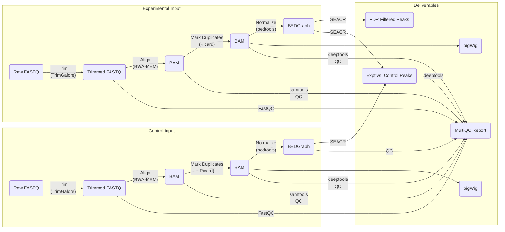

# CUT-and-TAG

# Overview

This is a snapshot of the workflow as it currently stands following the nextflow update (27 Apt 2022)



# Inputs

This pipeline is written in Nextflow and takes several inputs that relate to both the samples to be analyzed as well as the parameters to run the pipeline. All of these parameters can be passed as flags when `nextflow run` is called or specified in the `nextflow.config` file in the run directory. Syntax for doing either of these will be listed with the inputs below.

## Sample Sheet 

`--sampleSheet NF_Metadata.tsv` or `params.sampleSheet='NF_Metadata.tsv'`

This specifies the sample name, antibody target, sex, genotype, replicate, paths to the FASTQ files, and the sample name of the corresponding control file. An example sample sheet is located in this repo [here](NF_Metadata.tsv) and an example is shown below with a control and treatment sample. This file should not have headers and any sample that is to be used as a control must have `NA` in the antibody target column. Additionally, the treatment samples must use the exact sample name of the corresponding control sample. Currently the pipeline does not support running experiments without controls, but this is [known issue](https://github.com/cedars-sinai-genomics-core/CUT-and-TAG/issues/5).

```
WT_f_CTnAb_rep1 NA      F       WT      1       /common/genomics-core/data/GenomicsCloud/Li_Xue/GZ-14821--12--08--2021/FASTQ/WT_f_CTnAb_CKDL210016739-1a-AK1576-N504_HJMNKDSX2_L3_1.fq.gz       /common/genomics-core/data/GenomicsCloud/Li_Xue/GZ-14821--12--08--2021/FASTQ/WT_f_CTnAb_CKDL210016739-1a-AK1576-N504_HJMNKDSX2_L3_2.fq.gz       NA
WT_f_CTK27ac_rep1       K27ac   F       WT      1       /common/genomics-core/data/GenomicsCloud/Li_Xue/GZ-14821--12--08--2021/FASTQ/WT_f_CTK27ac_1_CKDL210016739-1a-AK1566-N504_HJMNKDSX2_L3_1.fq.gz   /common/genomics-core/data/GenomicsCloud/Li_Xue/GZ-14821--12--08--2021/FASTQ/WT_f_CTK27ac_1_CKDL210016739-1a-AK1566-N504_HJMNKDSX2_L3_2.fq.gz   WT_f_CTnAb_rep1
```

## Bowtie2 reference prefix for the host genome 

`--Ref /common/genomics-core/reference/Bowtie/mm10/mm10*` or `params.Ref='/common/genomics-core/reference/Bowtie/mm10/mm10*'`

This reference must be prebuilt as the pipeline will not do it for you. These paths must also contain the `*` wildcard since this is used to collect the appropriate files among the reference. This path must also be absolute and located in the `/common/genomics-core/` directory since other directories are not mounted in the Singularity container that runs the pipeline
## Bowtie2 reference prefix for the spike in genome

`--SpikeRef /common/genomics-core/reference/Bowtie/fastq_screen/Ecoli/Ecoli*` or `params.SpikeRef='/common/genomics-core/reference/Bowtie/fastq_screen/Ecoli/Ecoli*'`

The same stipulations apply for this as for the host genome. Note as well that this cannot be blank. If no spike in was used, leave the default path and the pipeline will ignore it.

## GTF of genomic features to summarize across

`--GTF /common/genomics-core/reference/Genome_Sequences/GRCm38.p4/gencode.vM8.annotation.gtf` or `params.GTF = '/common/genomics-core/reference/Genome_Sequences/GRCm38.p4/gencode.vM8.annotation.gtf'`

Also note that this must be an absolute path located in the `/common/genomics-core/` folder.

## Minimum quality score for mapping

`--minQualityScore 2` or `params.minQualityScore = 2`

This will be used to filter alignments that do not align well to the genome. You likely don't need to change this parameter.

## Bin size (in bp)

`--binLen 50` or `params.binLen = 50` 

Used for calculating coverage, summarizing peaks, and QC. Smaller bin sizes will give more resolution, but increase run times. Bin sizes as low as 10 can be used to get very fine resolution for different transcription factors. Large bin sizes will speed the pipeline but may not make biological sense if the expected regions are very close together.

## Whether a Spike-In in was used

`--Spike false` or `params.Spike = false`

This flag will be used by nextflow to decide whether to normalize with the spike in.

## Chromosome sizes

`--chromSize /common/genomics-core/apps/CUT-and-TAG/mm10.chrom.sizes` or `params.chromSize = '/common/genomics-core/apps/CUT-and-TAG/mm10.chrom.sizes'`

The repo contains these files for the most recent [human](hg38.chrom.sizes) and [mouse](mm10.chrom.sizes) genomes indexed by Bowtie2. Also note that these must be absolute paths located in the `/common/genomics-core/` folder.


## Renaming File

`--RenameQC /common/genomics-core/apps/CUT-and-TAG/QC_Rename.tsv` or `params.RenameQC = '/common/genomics-core/apps/CUT-and-TAG/QC_Rename.tsv'`

This is used to rename sample names during the QC step. The default file specified should work for many sample name, but can be changed with regex expressions in the format `<pattern>	<replacement>`.

## FDR threshold

`--FDR_Thresh 0.01` or `params.FDR_Thresh = 0.01`

Used filtering of peaks from SEACR.


## Notes
 - If you specify these parameters within the config file you can either list them individually and prefix them with `params.` as shown above or wrap several of them within `params { }` and omit the `params.` prefix. Consult the provided [config file](nextflow.config) for an example. 
 - Do not modify the config file in this repo, make a copy instead and place it in the working directory to execute the pipeline.

# Execution

There is an example submission script provided in this repo, `CUT-AND-TAG.sh` that can be used to run the pipeline on the HPC with the following command:

```
qsub CUT-AND-TAG.sh
```

It is best to make a copy of this run script and the config file in the working directory for your records for later. 

# Outputs

The pipeline should create several subfolders with the `results` directory where the pipeline is executed.

```
results/
├── align
├── peaks
├── QC
└── trim
```
## Trimming

Following `Trim_Galore`, the trimming FASTQ files are written to this directory for reference.

## Alignment

One `BAM` file for each sample along with its index is created. This file is filtered basd on mapping quality, sorted, and duplicate marked.

## Peak Calling

 - A `bedGraph` and `bigWig` file for each sample is created in the `peaks` directory. 
 - Following `SEACR` up to two additional `BED` files are created for each non-control sample. 
 	- `*_Control.SEACR.bed` shows the genomic locations of peaks that were called after normalizing based on the corresponding control sample
 	- `*_FDR_<FDR Threshold>.SEACR.bed` shows the genomic locations of peaks that were called after filtering based on the specified FDR.

## QC

This directory holds the MultiQC report and corresponding report data for the experiment.

# Notes

## Monitoring Runs 

One of the most useful aspects of nextflow is that you can monitor the runs in real time with [Tower](https://cloud.tower.nf). A link to the tower portal for each run will be output in the log file. You can use this to see how long jobs have been running, if they fail, and how long the pipeline has been going for. You will need to make a tower account, create an access token, and export that token as an environment variable (`export TOWER_ACCESS_TOKEN=`) prior to running the script in order for the run to show up on Tower. By default this pipeline will share its results with the [Cedars-Sinai-Genomics-Core](https://tower.nf/orgs/Cedars-Sinai-Genomics-Core) Tower organization page under the Epigenomics workspace. You will need to be invited to this workspace by an existing member.

## Failed Runs

For a number of reasons, the pipeline might fail. By default if a job fails, it will retry at least once and usually request more computational resources, since this is the primary reason for failure. If that doesn't work, the pipeline will exit after all running jobs complete and send you an email with an error report. Often it fails because of some temporary glitch and should just be restarted. As long as you do not alter any of the inputs to the pipeline, you can resume a failed run by adding the `-resume` flag to the end of the `nextflow run` command. It will take a while to parse through the previous run and determine what needs to be completed again, but it is generally a huge time saver. If you alter parameters before resuming, the pipeline will start from the beginning.

## Conda Environment

Each run script opens a conda environment (`nextflow`) where nextflow is installed. The environment should be available to you after running the following.

``` bash
module load anaconda3
conda activate nextflow
```

However, you may need to specifcy the full path to the nextflow environment `/common/genomics-core/apps/.conda/envs/nextflow`.


## Cleanup

Nextflow generates a large amount of temporary files which are saved by default in the `./work/` directory. These are useful for resuming a failed run, but not much else. The take up a large amount of storage space and should be removed after the pipeline successfully completes. You can do this by simple deleting the `work` folder. You can also run `nextflow clean` to remove most of the files, however this still leaves a lot behind.

